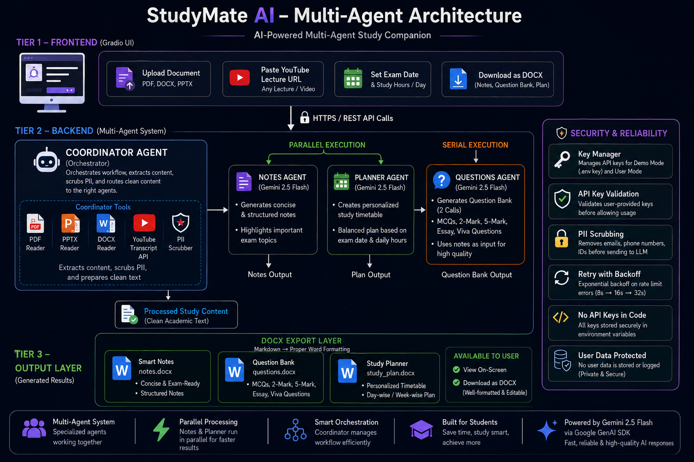
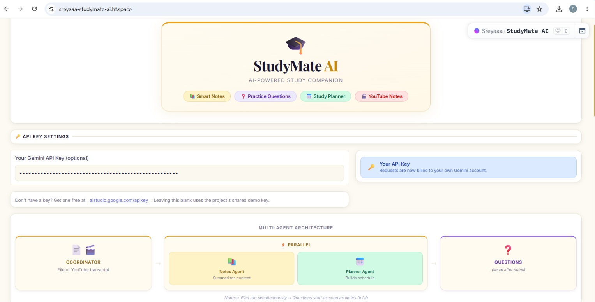
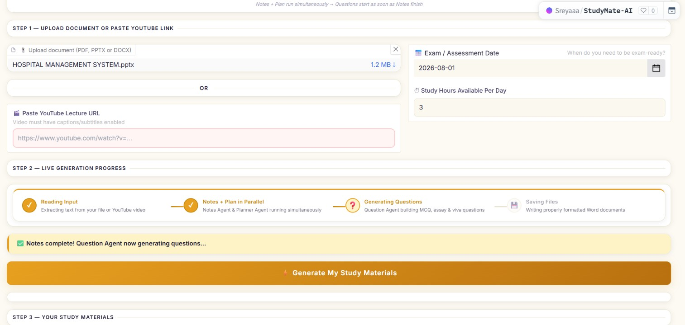
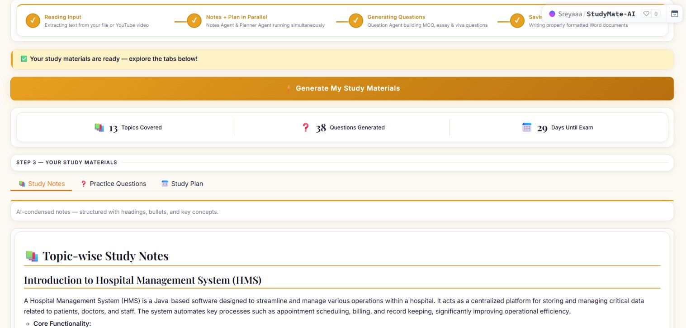
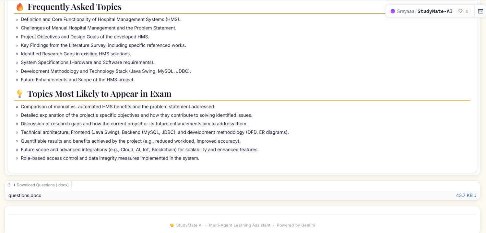

<div align="center">

# 🎓 StudyMate AI
### AI-Powered Multi-Agent Study Companion

[](https://python.org)
[](https://ai.google.dev)
[](https://gradio.app)
[](LICENSE)

**StudyMate AI is an AI-powered multi-agent study assistant that helps students generate notes, practice questions, and personalized study plans from documents and YouTube lectures.**

[Live Demo](https://sreyaaa-studymate-ai.hf.space) · [Demo Video](#demo) · [Architecture](#architecture) · [Setup](#setup)
</div>

---

## 📋 Table of Contents

- [Problem Statement](#problem-statement)
- [Solution](#solution)
- [Key Features](#key-features)
- [Multi-Agent Architecture](#multi-agent-architecture)
- [Agent Concepts Applied](#agent-concepts-applied)
- [Tech Stack](#tech-stack)
- [Project Structure](#project-structure)
- [Setup & Installation](#setup--installation)
- [Configuration](#configuration)
- [Usage Guide](#usage-guide)
- [Security](#security)
- [Kaggle Track](#kaggle-track)

---

## 🎯 Problem Statement

Students preparing for university exams face a fragmented, time-consuming process:

- **Information overload** — lecture slides and textbooks are dense and unstructured
- **No personalization** — generic study guides don't adapt to individual exam dates or available time
- **Language barriers** — technical lectures in one language exclude students who learn better in another
- **Passive learning** — reading notes without active recall (practice questions) leads to poor retention
- **Manual planning** — creating a realistic study timetable requires effort most students skip

Existing tools solve one of these problems in isolation. No single tool addresses the entire exam preparation pipeline end-to-end.

---

## 💡 Solution

StudyMate AI is a **multi-agent system** that takes any academic input — a PDF, PPTX, DOCX, or YouTube lecture URL — and automatically generates three coordinated study artifacts:

| Output | Description |
|---|---|
| 📚 **Smart Notes** | Concise, structured revision notes with important exam topics flagged |
| ❓ **Question Bank** | Full essay questions, 5-mark/2-mark Q&A, MCQs, and viva questions |
| 📅 **Study Planner** | Personalized day/week timetable scaled to the exact days until the exam |

All three outputs are available **on-screen and as downloadable Word documents (.docx)** with proper formatting, headings, and tables.

---

## ✨ Key Features

- **Multi-format input** — PDF, PPTX, DOCX, and YouTube lecture URLs
- **Multilingual YouTube support** — auto-detects transcript language, translates to English via YouTube's API, or passes foreign text directly to Gemini for translation
- **Parallel agent execution** — Notes Agent and Planner Agent run simultaneously; Questions Agent fires as soon as notes are ready, minimizing total generation time
- **Dual API key mode** — Demo Mode uses the project's key (.env); users can paste their own Gemini key to use their own quota
- **Retry with exponential backoff** — automatically retries on Gemini rate-limit errors (8s → 16s → 32s) instead of failing immediately
- **Proper DOCX export** — tables, headings, bold/italic, and bullet points all render as real Word formatting, not raw markdown symbols
- **PII scrubbing** — email addresses, phone numbers, and student IDs are redacted before text is sent to any AI model
- **Live progress stepper** — 4-stage animated progress indicator updates in real time during generation

---

## 🏗️ Multi-Agent Architecture

<p align="center">
  

</p>

StudyMate AI follows a coordinator-based multi-agent architecture. The Coordinator Agent extracts and preprocesses content before dispatching it to specialized AI agents. Notes Agent and Planner Agent execute in parallel to reduce response time, while the Questions Agent generates assessments from the produced notes. All outputs are exported as downloadable DOCX files.


### Why Parallel Execution?

Notes and Plan generation are **independent** — both only need the raw extracted text. Running them simultaneously saves significant wall-clock time. Questions generation depends on the notes output (for quality and relevance), so it runs serially after Notes finishes, while the Plan may still be computing in parallel.

### Retry / Backoff Layer (`llm_provider.py`)

All three AI agents route through a unified `generate_text()` function that implements **exponential backoff** on Gemini rate-limit errors:

```
Attempt 1 → fail (rate limited) → wait 8s
Attempt 2 → fail (rate limited) → wait 16s
Attempt 3 → fail (rate limited) → wait 32s
Attempt 4 → fail → raise clear error to UI
```

This prevents the "halfway done, quota exceeded" failure mode that occurs when parallel agents consume the per-minute request budget simultaneously.

---

## 🧠 Agent Concepts Applied

This project demonstrates the following key concepts from the AI Agents course:

| Concept | Where Applied |
|---|---|
| **Multi-agent system** | 4 specialized agents (Coordinator, Notes, Questions, Planner) with defined roles and data flow |
| **Parallel agent execution** | `ThreadPoolExecutor` runs Notes + Planner simultaneously, Questions waits on Notes output |
| **Agent tool use** | Each agent uses specialized tools: PDF reader, PPT reader, DOCX reader, YouTube transcript API, PII scrubber |
| **Security features** | PII scrubbing before LLM calls; API key masking in UI; user key validated before use; no keys in code |
| **Deployability** | Gradio web UI with local and network deployment; structured for Hugging Face Spaces deployment |
| **Resilience / error handling** | Retry with exponential backoff; per-agent empty-response guards; clear error messages surfaced to UI |
| **Dual API key mode** | Demo Mode (project key) + User Mode (user's own key) managed via `key_manager.py` |

---

## 🛠️ Tech Stack

| Layer | Technology |
|---|---|
| **UI** | Gradio 6.0+ |
| **LLM** | Google Gemini 2.5 Flash (`google-genai` SDK) |
| **Agents** | Pure Python with `concurrent.futures.ThreadPoolExecutor` |
| **YouTube** | `youtube-transcript-api` v1.2+ (multilingual, auto-translate) |
| **PDF extraction** | `pypdf` |
| **PPTX extraction** | `python-pptx` |
| **DOCX extraction** | `python-docx` |
| **DOCX export** | `python-docx` with custom markdown-to-Word renderer |
| **Environment** | `python-dotenv` |

---

## 📁 Project Structure

```
StudyMateAI/
├── agents/
│   ├── coordinator_agent.py   # Orchestrates file reading and text extraction
│   ├── notes_agent.py         # Generates structured revision notes
│   ├── quiz_agent.py          # Generates question bank (split into 2 calls)
│   ├── planner_agent.py       # Generates personalized study timetable
│   ├── youtube_agent.py       # Fetches & translates YouTube transcripts
│   ├── key_manager.py         # API key validation and dual-mode management
│   └── llm_provider.py        # Unified LLM layer with retry/backoff
│
├── tools/
│   ├── pdf_reader.py          # PDF text extraction (pypdf)
│   ├── ppt_reader.py          # PPTX text + table extraction (python-pptx)
│   ├── docx_reader.py         # DOCX text + table extraction (python-docx)
│   └── pii_scrubber.py        # Regex-based PII redaction
│
├── ui/
│   └── gradio_uie.py          # Full Gradio UI with markdown-to-DOCX export
│
├── outputs/                   # Generated .docx files (gitignored)
├── .env                       # API keys (gitignored — never commit this)
├── .env.example               # Template for environment setup
├── requirements.txt
└── README.md
```

---

## ⚙️ Setup & Installation

### Prerequisites

- Python 3.11 or higher
- A free Gemini API key from [Google AI Studio](https://aistudio.google.com/apikey)

### 1. Clone the repository

```bash
git clone https://github.com/YOUR_USERNAME/StudyMateAI.git
cd StudyMateAI
```

### 2. Create a virtual environment

```bash
python -m venv venv

# Windows
venv\Scripts\activate

# macOS / Linux
source venv/bin/activate
```

### 3. Install dependencies

```bash
pip install -r requirements.txt
```

### 4. Configure environment variables

```bash
cp .env.example .env
```

Open `.env` and add your Gemini API key:

```env
GEMINI_API_KEY=your_gemini_api_key_here
```

### 5. Run the app

```bash
python app.py
```

Open your browser at **http://127.0.0.1:7860**

---

## 📦 Requirements

Create a `requirements.txt` with:

```
gradio>=6.0.0
google-genai
python-dotenv
pypdf
python-pptx
python-docx
youtube-transcript-api>=1.2.0
```

---

## 🔧 Configuration

### `.env.example`

```env
# Required: Your Google Gemini API key
# Get one free at https://aistudio.google.com/apikey
GEMINI_API_KEY=your_gemini_api_key_here
```

### API Key Modes

| Mode | Description |
|---|---|
| **Demo Mode** 🟢 | App uses `GEMINI_API_KEY` from `.env`. Faculty and testers can use the app immediately with no setup. |
| **User Mode** 🔑 | User pastes their own Gemini key into the sidebar. All requests are billed to their account, preserving your demo quota. |

The app detects which mode to use automatically — if no user key is entered, it falls back to your `.env` key silently.

---

## 📖 Usage Guide

### Uploading a Document

1. Click **"Upload document"** and select a PDF, PPTX, or DOCX file
2. Set your **Exam Date** and **Study Hours Per Day**
3. Click **⚡ Generate My Study Materials**
4. Watch the 4-stage progress stepper update in real time
5. Explore the **Study Notes**, **Practice Questions**, and **Study Plan** tabs
6. Download any output as a properly formatted `.docx` Word document

### Using a YouTube Lecture

1. Leave the file upload empty
2. Paste a YouTube lecture URL into the **"Paste YouTube Lecture URL"** field
3. The app will automatically fetch the transcript, translate if needed, and generate all three study artifacts from the video content

### Using Your Own API Key

1. Paste your Gemini API key into the **"Your Gemini API Key"** field at the top
2. The status badge will update to **"Your API Key"** once validated
3. All subsequent requests will use your own Gemini quota

---

## 🔒 Security

- **No API keys in code** — all keys loaded from `.env` via `python-dotenv`
- **`.env` is gitignored** — never committed to version control
- **API key masking** — user-entered keys use `type="password"` in the UI
- **Key validation** — user keys are tested with a minimal API call before being trusted; invalid keys fall back to Demo Mode automatically
- **PII scrubbing** — before any document text is sent to Gemini, the `pii_scrubber` redacts email addresses, phone numbers, and student/roll IDs using strict regex patterns
- **No persistent key storage** — user keys are held only in Gradio session state, never written to disk

---

## 🏆 Kaggle Track

This project is submitted under the **Agents for Good** track.

**Why Agents for Good?**

StudyMate AI directly addresses educational equity. Students in under-resourced environments — where quality tutors and study materials are expensive or inaccessible — can upload any lecture material and receive a complete, personalized exam preparation kit in seconds. The multilingual YouTube support specifically targets students who access technical education through non-English lectures, breaking a significant language barrier in global education.

## Application Screenshots





**Course Concepts Demonstrated:**

- ✅ Multi-agent system with defined roles and data flow
- ✅ Parallel agent execution for performance optimization
- ✅ Security features (PII scrubbing, key masking, key validation)
- ✅ Deployability (Gradio web UI, local + network access, Hugging Face Spaces ready)
- ✅ Agent tool use (specialized readers, YouTube API, PII scrubber)
- ✅ Resilience (retry/backoff, empty-response guards, clear error surfacing)

## 🚀 Future Roadmap

While StudyMate AI is fully functional, several enhancements are planned to further improve accessible and personalized education:

- **Multilingual Study Materials** – Generate notes, questions, and study plans in multiple languages to support learners worldwide.
- **Interactive Quiz Mode** – Transform the generated question bank into an interactive quiz with instant feedback to improve learning outcomes.
- **Accessibility Features** – Add text-to-speech, speech-to-text, and dyslexia-friendly reading modes for students with diverse learning needs.
- **Additional Learning Resources** – Support handwritten notes, images, and audio lectures using OCR and speech recognition technologies.
- **Cloud Sync & Progress Tracking** – Allow students to securely save their study materials and monitor their learning progress across devices.
- **Offline Support** – Enable core features to work with limited internet connectivity, making the application more accessible in underserved regions.


---

## 📄 License

MIT License — see [LICENSE](LICENSE) for details.

---

<div align="center">

💛 Built for the **Kaggle AI Agents: Intensive Vibe Coding Capstone Project**

Powered by **Google Gemini 2.5 Flash** · Built with **Gradio** · Made with ❤️

</div>